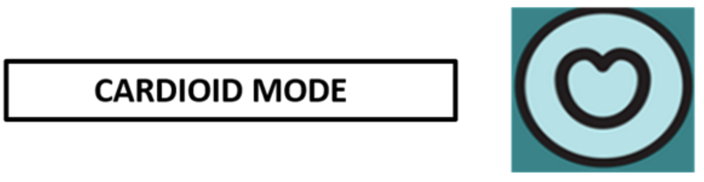
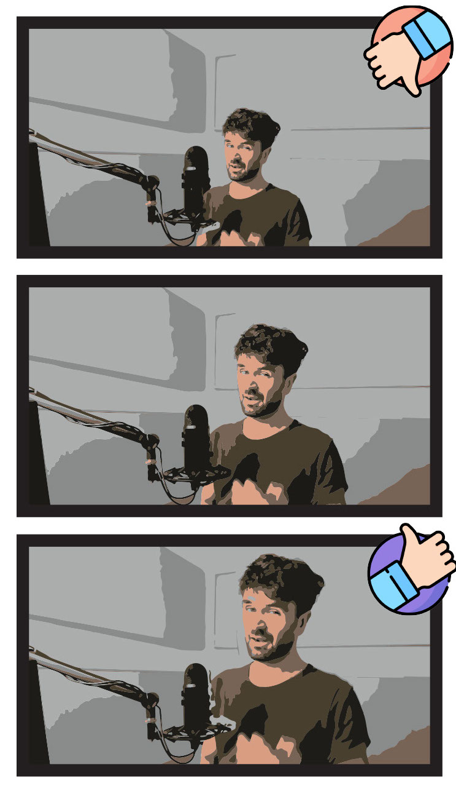

# Opname&shy;studio checklist
Welkom in de opnamestudio! Hieronder een checklist van wat je allemaal kan doen om de opname van een zo hoog mogelijke kwaliteit te maken.
1. Leg de verdeelstekker aan die aan de linkerpoot van de standing desk bevestigd is. Dit zou ervoor moeten zorgen dat het licht, camera, scherm, microfoon en docking station aan staan.
2. De standing desk kan je op jouw hoogte afstellen door aan het hendeltje aan de desk aan de rechterkant te draaien.
3. Plaats je laptop op de aangegeven plek op de standing desk, Deze plek is zo gekozen, zodat je optimale kadrage hebt wanneer je met de camera zou opnemen.
4. Bevestig je laptop aan de docking station, deze connecteert je met alle hardware.
5. Leg vervolgens de spotjes in de opnamestudio af, adhv de kleine knopjes aan de andere kant van het raam. Zo heb je geen lelijk licht van bovenaf wanneer je de camera gebruikt. 
6. Zorg ervoor dat je wel het rode lampje laat branden via deze zelfde schakelaars. Zo kunnen collega's in de C3 zien dat je aan het opnemen bent. 
7. Voor je de opname begint, sluit je best de deur van de opnamestudio, zo heb je het minste last van geluid van buitenaf.
8. Je kan het geluid testen door de koptelefoon aan te doen terwijl je in de microfoon spreekt, test wanneer je te dicht en wanneer je te ver van de microfoon zou zijn. De settings van de microfoon zouden normaal goed moeten staan, maar die kan je altijd nog eens dubbel checken: 
   1. Je mag geen ruis horen, laat het knopje achteraan de microfoon van **gain** best zo dicht mogelijk op 0 staan (helemaal links)
   2.  De settings mag op Cardioid staan:
   
9.  Vervolgens draai je aan de knop aan de voorkant ergens naar het midden terwijl je spreekt. Dit bepaald hoe luid je stem opgenomen wordt.
10. Test nog een laatste keer hoe je in beeld komt: Je lichaam neemt best voldoende plaats in, je kan de camera van hoogte aanpassen, zorg er wel voor dat het beeld hierbij niet schuin komt te staan.
    
11. Voila, je bent klaar om via de software die jouw voorkeur draagt een opname te maken.

Mist er nog iets op dit document? Stuur even een berichtje naar mathieu spillebeen.

